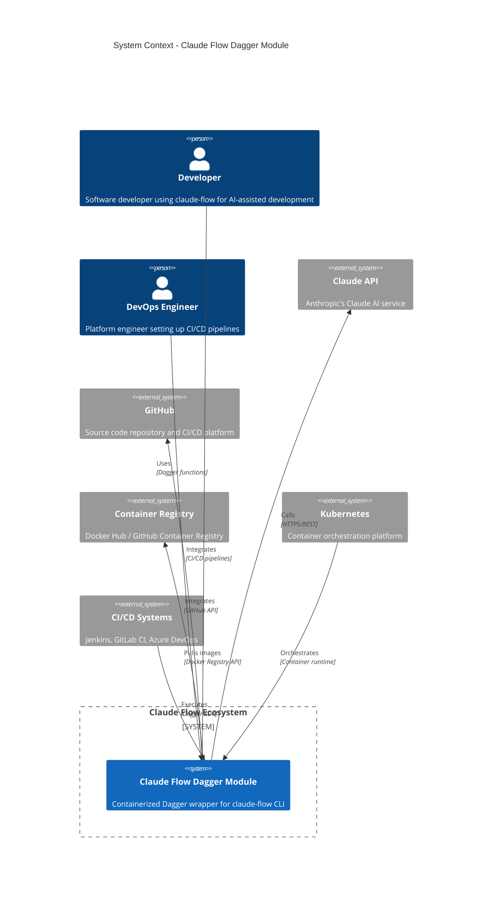
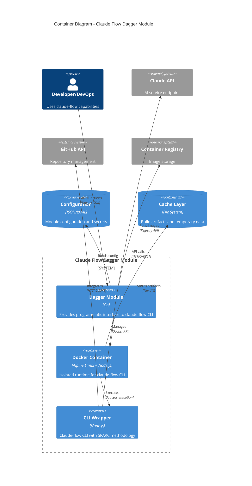
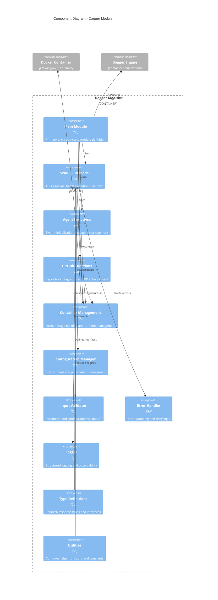
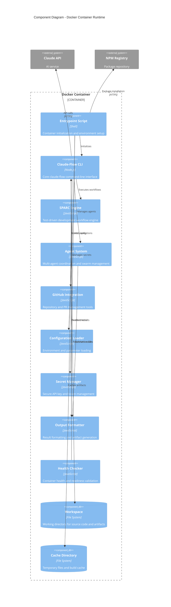
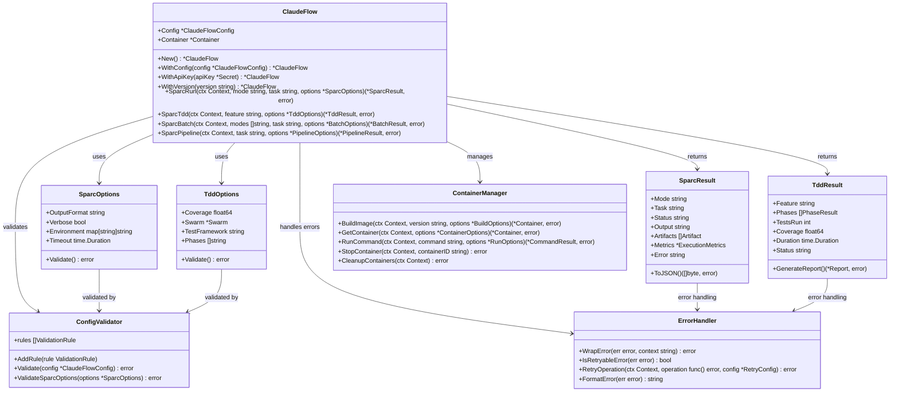
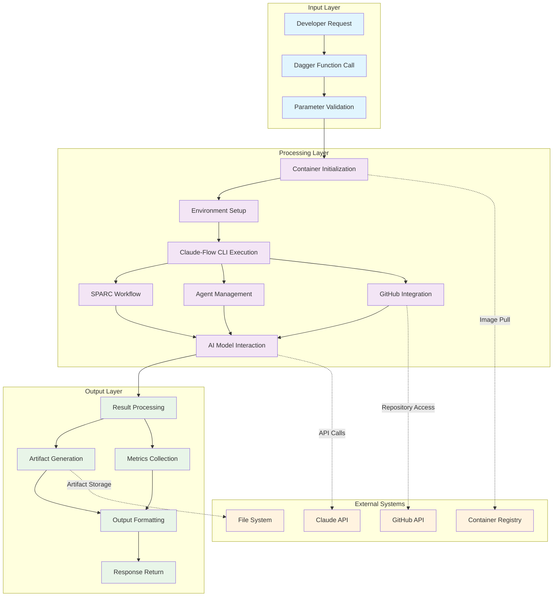
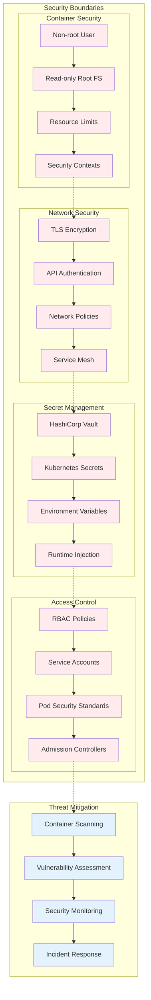

# C4 Architecture Diagrams

## C4 Model Overview

The C4 model provides a hierarchical approach to documenting the claude-flow Dagger module architecture through four levels of abstraction: Context, Containers, Components, and Code.

## Level 1: System Context Diagram



## Level 2: Container Diagram



## Level 3: Component Diagram - Dagger Module



## Level 3: Component Diagram - Docker Container



## Level 4: Code Diagram - SPARC Functions



## Deployment Architecture Diagram

```mermaid
C4Deployment
    title Deployment Diagram - Claude Flow Dagger Module

    Deployment_Node(dev_machine, "Developer Machine", "Local development") {
        Container(local_dagger, "Dagger CLI", "Go binary")
        Container(local_docker, "Docker Desktop", "Container runtime")
    }
    
    Deployment_Node(ci_server, "CI/CD Server", "GitHub Actions / Jenkins") {
        Container(ci_runner, "CI Runner", "Ubuntu VM")
        Container(dagger_ci, "Dagger Module", "Container execution")
    }
    
    Deployment_Node(k8s_cluster, "Kubernetes Cluster", "Production environment") {
        Deployment_Node(worker_node, "Worker Node", "K8s Node") {
            Container(claude_flow_pod, "Claude Flow Pod", "Application container")
            Container(sidecar, "Monitoring Sidecar", "Observability")
        }
        
        Deployment_Node(control_plane, "Control Plane", "K8s Master") {
            Container(api_server, "API Server", "K8s API")
            Container(scheduler, "Scheduler", "Pod scheduling")
        }
    }
    
    Deployment_Node(external_services, "External Services", "Cloud providers") {
        Container(claude_api_ext, "Claude API", "Anthropic service")
        Container(github_ext, "GitHub", "Repository hosting")
        Container(registry_ext, "Container Registry", "Image storage")
    }
    
    Rel(local_dagger, dagger_ci, "Triggers build", "CI/CD pipeline")
    Rel(dagger_ci, claude_flow_pod, "Deploys", "K8s API")
    Rel(claude_flow_pod, claude_api_ext, "API calls", "HTTPS")
    Rel(claude_flow_pod, github_ext, "Repository access", "HTTPS")
    Rel(k8s_cluster, registry_ext, "Pulls images", "Registry API")
    
    UpdateRelStyle(local_dagger, dagger_ci, $offsetY="-30")
    UpdateRelStyle(dagger_ci, claude_flow_pod, $offsetX="-50")
```

## Data Flow Diagram



## Security Architecture Diagram



These C4 diagrams provide a comprehensive view of the claude-flow Dagger module architecture at different levels of abstraction, from high-level system context down to detailed code structure, deployment, data flow, and security considerations.